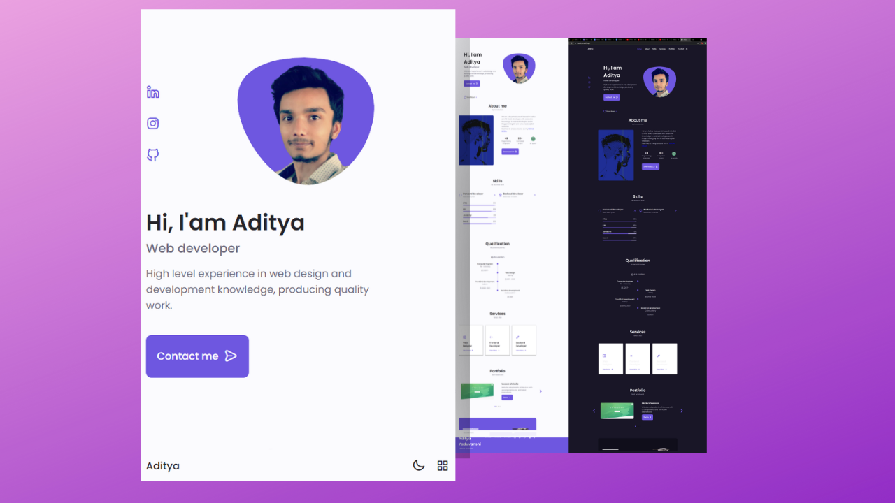

# Personal Portfolio
My Portfolio website

## About the project
Description: This is my personal poertfolio website. My website has many sections.It is developed first with the Mobile First methodolgy,then for desktop. This is fully responsive webiste. I have used flex and grid system to give the design. I took this design from Dribble. I have used Vanilla JavaScript to give amazing functionalies. I have used HTML, CSS and JavaScript to make this beautiful website and other tools i have used are Swiper, Iconscout, VS Code. 

Technical Skills:
Language: JavaScript, HTML, CSS
Tools: VS Code, Swiper, Iconscout

## Link to website
   Live Demo - https://theaditya.netlify.app/

## Screenshot 

##  Features
<ol>
  <li> Responsive Website</li>
  <li>Dark and Light Modes</li>
  <li>Beautiful Interface</li>
<li>With animations when scrolling</li>
  <li>Developed first with the Mobile First methodology, then for desktop.</li>
  <li>Compatible with all mobile devices and with a beautiful and pleasant user interface.</li>
</ol>

## Technical Skills used
<ul>
  <li>Language: Javascript,HTML,CSS</li>
  <li>Tools: VS Code,Swiper, Iconscout</li>
  
  </ul>
  
  
## Contact me
<ul>
  <li>Created by Aditya Yaduvanshi</li>
  <li>Twitter -- <a href="https://twitter.com/fixslyr">Fixslyr</a>
    <li>Medium -- <a href="https://adityayaduvanshi.medium.com/">Aditya Yaduvanshi</a>
      <li>Linkedin -- <a href="https://www.linkedin.com/in/theaditya-yaduvanshi-/">Aditya Yaduvanshi</a>
  </ul>
